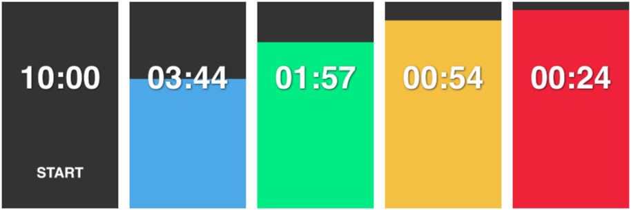

# Clepsydre (temporary name)

**This is a presentation timer, meant to be run in full screen on any browser.**

The screen fills up from the bottom to give a clear indication of the time remaining. Once the screen is filled up, the time is over.
The colors change too :
- from 0 to 80% it's blue: you have time
- from 80% to 90% it turns green. You still have time.
- from 90% to 95% it turns yellow, hurry up.
- from 95% to 100% it turns red, your time is almost over.

## Features

* Works in any browser, no app required
* Colors make a clear indication of time left from afar
* On phones, the screen will stay awake during the timer
* Duration is customizable
* Alternate colors for colorblind people
* Optional subtle beep when the time is up

## Origin of the name
Clepsydre, from [french Wikipedia](https://fr.wikipedia.org/wiki/Clepsydre) :
>À l'origine, la clepsydre est un instrument à eau qui permet de définir la durée d'un événement, la durée d'un discours par exemple.

From the [English wikipedia](https://en.wikipedia.org/wiki/Water_clock) :
>A water clock, or **clepsydra**, is a timepiece by which time is measured by the regulated flow of liquid into (inflow type) or out from (outflow type) a vessel, and where the amount of liquid can then be measured.

## Settings

You can change any setting through the cog in the lower right corner. \
Some settings can also be set through url params if you want to bookmark a specific timer.

### Timer duration

The default duration of the timer is 10 minutes.

You can preset it through the url parameter `duration=YOUR_VALUE_HERE` in the url. It accepts minutes (`m`) and seconds (`s` or no unit) or `mm:ss` format like this :
* `?duration=20s` for 20 seconds
* `?duration=15m` for 15 minutes
* `?duration=2m30s` for 2 minutes and 30 seconds
* `?duration=2:30` same with a different format
* `?duration=30` for 30 seconds (no unit means seconds)
* `?duration=60m` for 1 hour

### Sound
You can enable a subtle beep when the timer reaches 00:00 by adding the parameter `sound=true` in the url.
For example :
* https://zenika-open-source.github.io/clepsydre/?sound=true if you use the default duration
* https://zenika-open-source.github.io/clepsydre/?duration=20s&sound=true when you also customize the duration

### Colors

There is an alternate color scheme based on IBM Design Library that should work for colorblind people. Please let us know if the colors are not contrasted enough.

### Color change thresholds

The 3 threshold at which the color changes can be changed in the settings.

## Wakelock

There is a wakelock to prevent the phone from going to sleep once the timer is started.

Once the timer reaches 00:00 the screen will stay on so you can see the time is up even if you go over your alloted time.

Be mindful of your phone since it will stay unlocked.

## Demo
Here is a timer of 20 seconds : [https://timer.zenika.com?duration=20s](https://timer.zenika.com?duration=20s)

You can use this url anytime and adapt the duration to your need.

## Credits

This project is greatly inspired from the Android app [Presentation Timer from Neuron Digital](https://play.google.com/store/apps/details?id=com.neurondigital.presentationtimer&hl=fr).
Unfortunately this app only exists on Android and I thought it could be useful on iphones and other devices too.

